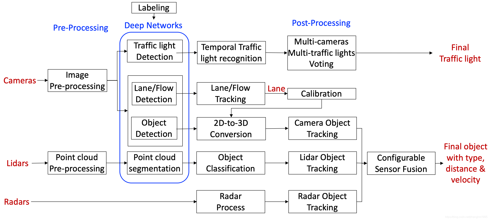

**内容多为网络收集部分，链接忘记保留了，回头补充上**
关于Apollo源码的笔记
* 1-CompileAndRun: 编译和执行笔记
* 2-Architecture:架构设计
* MyNote.md:


# 1 :book:GO&概述


> **软件架构**
>
> 


# 2:book: 资源


> 官网：
>
> https://gitee.com/ApolloAuto/apollo


> 民间`apollo  1.0`
>
> https://github.com/slam-code/apollo
>
> 
>
> https://blog.csdn.net/learnmoreonce/category_7120890.html?spm=1001.2014.3001.5482


> **Apollo3.5代码讲解（含视频）**
>
> [Apollo 3.5 计算框架（Cyber RT）设计分享](https://edu.csdn.net/course/detail/16425?utm_medium=distribute.pc_relevant_t0.none-task-course-2%7Edefault%7EBlogCommendFromMachineLearnPai2%7Edefault-1.baidujs&dist_request_id=1328769.72293.16177198215561269&depth_1-utm_source=distribute.pc_relevant_t0.none-task-course-2%7Edefault%7EBlogCommendFromMachineLearnPai2%7Edefault-1.baidujs)
>
> 


> **Apollo5.5的源码剖析**
>
> https://blog.csdn.net/zhanghm1995?t=1&type=blog
>
> 
>
> https://blog.csdn.net/zhanghm1995/category_10124039.html?spm=1001.2014.3001.5482
>
> 
>
> [Apollo 5.5 源码学习笔记（五） | transform模块 | Apollo中的坐标系统详解](https://blog.csdn.net/zhanghm1995/article/details/106151288?spm=1001.2014.3001.5502)
>
> 


# 3 :book:编译器 bazel


> 关于如何使用bazel编译c++代码，可以查看以下网址： 
> 【1】https://docs.bazel.build/versions/master/tutorial/cpp.html 
> 【2】https://docs.bazel.build/versions/master/tutorial/cpp-use-cases.html
>
> -----
>
> [Bazel入门：编译C++项目](https://blog.csdn.net/elaine_bao/article/details/78668657)
>
> 


## Install

安装过程请参考:http://bazel.io/docs/install.html


# 4 :book:理解执行流程


### 3-编译Apollo源码

**编译Apollo源码**

```shell
bash docker/setup_host/install_docker.sh
bash docker/scripts/dev_start.sh 
# 如果所需镜像满足要求，可以使用下面命令，免除镜像比较和更新，加快速度
#bash docker/scripts/dev_start.sh -n
```


**进入docker内并完成编译**

```shell
#进入docker
bash docker/scripts/dev_into.sh
#编译apollo
bash apollo.sh build_opt
```


### 4-运行DreamView


```shell
# a.若您已经在docker环境中，请忽略此步骤，否则请执行以下命令进入docker环境：
cd ~/apollo
bash docker/scripts/dev_start.sh
bash docker/scripts/dev_into.sh
# b.启动apollo 在终端输入以下命令：
bash scripts/bootstrap.sh
#如果启动成功，在终端会输出以下信息：
    nohup: appending output to 'nohup.out'
    Launched module monitor.
    nohup: appending output to 'nohup.out'
    Launched module dreamview.
    Dreamview is running at http://localhost:8888
```

在浏览器中输入以下地址,可以访问DreamView:

**http://localhost:8888**

```shell
# 回放数据包 在终端输入以下命令下载数据包：
python docs/demo_guide/rosbag_helper.py demo_3.5.record
#输入以下命令可以回放数据包，在浏览器DreamView中应该可以看到回放画面。
cyber_recorder play -l -f demo_3.5.record
# 如果成功在浏览器中看到回放画面，则表明您的apollo系统已经部署成功！
```


# 5:book: perception（感知模块）


> [Apollo 5.0源码学习笔记（一）| 感知模块 | 感知框架总览](https://blog.csdn.net/zhanghm1995/article/details/103246901)


> **软件架构**
>
> 
>
> --------
>
> **感知部分**
>
> 
>
> > `base`——整个感知模块公用的一些**基础类型**定义，比如表示感知目标的`Object`等类型；
> > `camera`——**相机**处理子模块；
> > `common`——整个感知模块公用的一些**基础操作**定义，如点云预处理、图像预处理等；
> > `data`——感知模块用到的数据，目前只有相机的标定参数yaml文件；
> >
> > `fusion`——**融合**处理子模块；
> > `interface`——整个感知模块的一些公用接口定义，目前里面好像都是视觉感知与显卡的一些的接口；
> > `lib`——整个感知模块公用的一些**算法**定义，如config_manager参数配置操作；
> > `lidar`——**激光雷达**处理子模块；
> >
> > `map`——**高精度地图**的一些操作，主要在感知模块中用于提取感兴趣区域；
> > `onboard`——上车运行程序，其中`component`文件夹可以认为是感知模块的入口；
> > `production`——感知模块所有**配置参数**定义；
> >
> > `proto`——感知模块`protobuf`文件定义；
> > `radar`——**毫米波雷达**处理子模块


